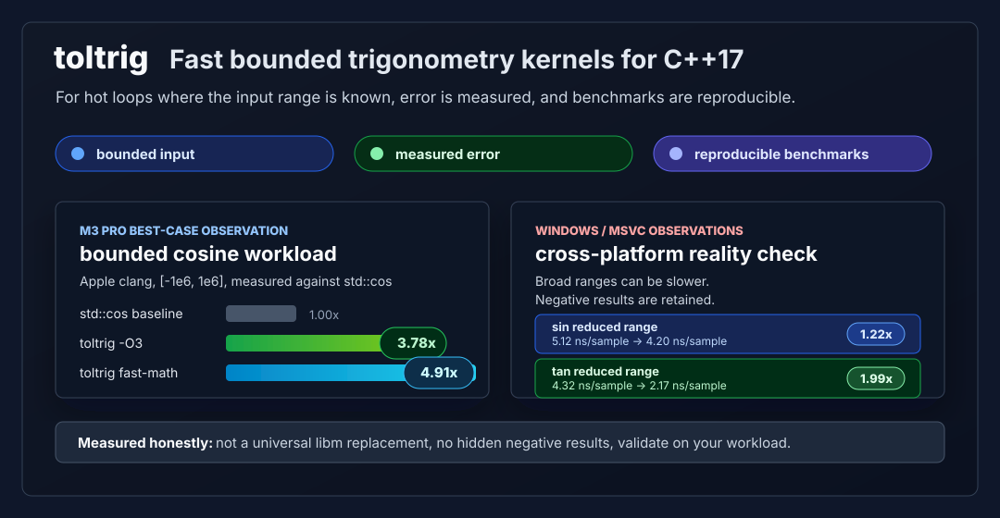
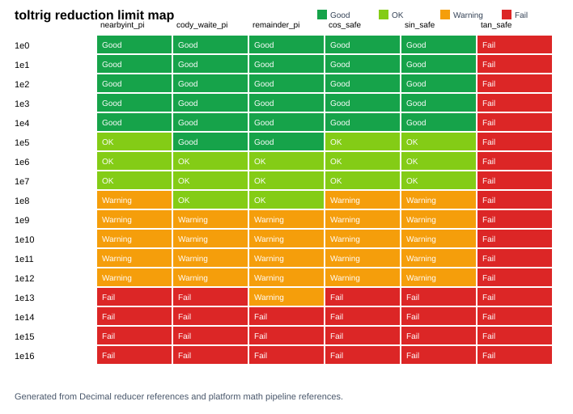

# toltrig

Fast bounded trigonometry kernels for C++17.

toltrig is for code that calls trigonometric functions many times while already
knowing the input range: simulations, animation phases, particle systems,
signal experiments, visualizers, and other tolerance-aware hot loops.

It trades universal `libm` guarantees for small header-only kernels with
measured error and reproducible benchmarks.





## Why it exists

`std::cos` is the right default when inputs are arbitrary and correctness
requirements are strict. In bounded-input workloads, that generality can be
more than the application needs.

toltrig makes that trade explicit:

| Use it when... | Avoid it when... |
| --- | --- |
| your angle range is documented | inputs may be huge or arbitrary |
| absolute error is acceptable | correctly-rounded results are required |
| trig calls are in a measured hot loop | speed claims are not benchmarked locally |
| a C++17 header-only dependency is useful | you need a production `libm` replacement |

Current stable focus: bounded `double` cosine. Experimental sine and tangent
kernels are available under `toltrig::experimental`.

## Versioning

The current pre-release is `0.2.0-alpha.1`. CMake uses project version `0.2.0`
because the alpha suffix is release metadata rather than a CMake numeric
version component.

## Current result summary

Measured results are platform-specific. On one M3 Pro Apple clang run,
`cos_bounded_n7` reached `3.78x` with `-O3` and `4.91x` with `-O3 -ffast-math`
versus `std::cos` on `[-1e6,1e6]`. Windows/MSVC gains were much smaller.
Keep negative results.

The range-reduction limit map above classifies reducer behavior over
`[-10^n, 10^n]` for `n = 0..16`. Current nearbyint/Cody-Waite reducers are
bounded-input tools, not huge-argument reducers. See
[docs/reduction_limits.md](docs/reduction_limits.md).

## Quick example

```cpp
#include <toltrig/toltrig.hpp>

double y = toltrig::cos_bounded_n8(toltrig::pi / 3.0);
```

## What toltrig is not

It does not claim universal speedup, correctly-rounded results, or
production-grade huge-argument reduction.

## Origin: Original pi-switch Formulation
The research started from:
```tex
f(\theta)=(-1)^{\lfloor\theta/\pi\rfloor}\sum_{k=0}^{10}
\frac{(-1)^k}{(2k)!}(\theta-\pi\lfloor\theta/\pi\rfloor)^{2k}
```
Later analysis found that `[0, pi)` is too wide for a zero-centered Taylor polynomial to guarantee high accuracy. The current bounded candidate uses `nearbyint(x / pi)` to target approximately `[-pi/2, pi/2]`.

## Installation
```sh
cmake -S . -B build
cmake --build build --config Release
ctest --test-dir build -C Release --output-on-failure
```

## API overview
Use `cos_reduced_n7/n8` only for inputs already in `[-pi/2, pi/2]`. Use `cos_bounded_n7/n8` for documented bounded inputs. `cos_remainder_n7/n8` retain a slower comparison-oriented reducer. `toltrig::cos` selects a precision and reduction policy.

## Accuracy notes
See [docs/accuracy.md](docs/accuracy.md). Validate against your actual input bound.

## Documentation map
- [Accuracy notes](docs/accuracy.md)
- [Benchmark methodology](docs/benchmark_methodology.md)
- [Claim policy](docs/claim_policy.md)
- [Experimental sine design](docs/sin_design.md)
- [Experimental sine accuracy](docs/sin_accuracy.md)
- [Experimental tangent design](docs/tan_design.md)
- [Experimental tangent accuracy](docs/tan_accuracy.md)
- [Range reduction limits](docs/reduction_limits.md)
- [Future work](docs/future_work.md)
- [Release checklist](docs/release_checklist.md)

## Benchmarking
```sh
./build/toltrig_bench --quick --csv results.csv
./build/toltrig_diagnostic --quick --csv diagnostic.csv
./build/toltrig_tan_bench --quick --csv tan-results.csv
./build/toltrig_sin_bench --quick --csv sin-results.csv
```

## Reproducibility
Report platform, compiler, flags, range, sample count, warm-up count, trials, and CSV output.

## Limitations
The stable API is focused on bounded `double` cosine. Sine and tangent support
are experimental and are not part of the stable API. toltrig does not claim
correctly-rounded results, and nearbyint-based bounded reducers are not
production-grade huge-argument reducers.

## Experimental tangent support
Experimental tangent support is available under `toltrig::experimental`.

This implementation is:
- bounded-input oriented
- not correctly rounded
- not a huge-argument reducer
- not part of the stable API

See [docs/tan_design.md](docs/tan_design.md) and
[docs/tan_accuracy.md](docs/tan_accuracy.md).

## Experimental sine support
Experimental sine support is available under `toltrig::experimental`.
It is not part of the stable API.

The repository compares direct sine Taylor evaluation against cosine reuse
through a phase shift. See [docs/sin_design.md](docs/sin_design.md) and
[docs/sin_accuracy.md](docs/sin_accuracy.md).

## Roadmap
See [docs/future_work.md](docs/future_work.md).

## Citation / report
See [docs/report.pdf](docs/report.pdf).

## License
MIT.
